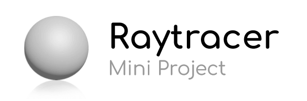

# Raytracer

This **raytracer** was the final mini-project of the course *programming languages* of the summer semester 2019 at the *Bauhaus University Weimar*. The class started with acquiring the basics of C++ before going into the more complex aspects of the language. The final mini-projects were made by teams of two people each.

## What does it do?

This program will parse a `.sdf` file and generate a scene from the `defines` inside. It will then render the shapes, lights, etc. using the defined camera and rendering information as an image in the `.ppm` file format.

*(Click [here](documentation/examples/rendered_spheres.png) for the enlarged, higher quality version of the screenshot!)*

The rendering process is completely done using raytracing and supports simples shapes like spheres, rectangles, and triangles. The program also supports blinn-phong shading, reflective surfaces, transparency, refraction, anti-aliasing, tone mapping, and gamma correction.

Animation and `.sdf` file generation is also possible. For a demo video of an animated rendered scene, click [here](https://raw.githubusercontent.com/christiandunkel/raytracer/master/documentation/examples/animation_demo.mp4).

## Try it out

You can clone or download the repository and build it using [CMake](https://cmake.org/), version `3.1`, or higher. Otherwise, you can also follow the step-by-step installation and usage guide here:

## Assignments
- [Style Guide](/documentation/styleguide_2019.pdf)
- [Assignments](/documentation/assignments/)
- [Solutions](/documentation/solutions_theory_part.md)
- [UML Diagram](/documentation/uml_diagram.md)
- [Presentation Slides](/documentation/presentation_slides.pdf)

## Other
- [Documentation](/documentation/documentation.md)
- [Credits](/documentation/credits.md)
- [License](LICENSE.md)