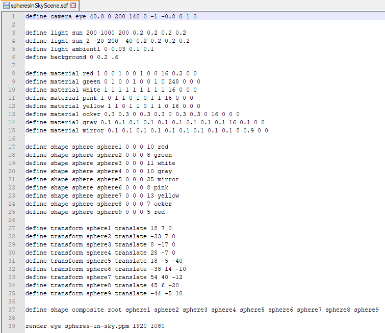

# Raytracer

This **raytracer** for simple shapes is the final mini project of the course "*programming languages*" in the summer semester of 2019 at the *Bauhaus University Weimar*. The class started with acquiring the basics of C++ before going into the more complex aspects of the language. The final mini project was made by teams consisting of two people each.

## What does it do?

The program reads an *sdf* file that contains data about a scene. The scene consists of shapes, lights, cameras, and rendering information. The program will construct a scene from this information that contains the references to all the shapes, cameras, and lights. Using the rendering information, the raytracer will now generate a **Netpbm** image of the **P**ortable **P**ix**M**ap format.

The raytracer will send out a ray for every pixel from the camera. The ray will hit the closest object or the background, which will be the base color. After that, it will reflect and possibly hit other objects or the background, of which the colors will be used to calculate the final color of the given pixel. Also, rays from all light sources will be sent out towards the intersection of ray and shape to calculate shadows. In addition to ambient lights, they will influence the final color of the pixel as well.

Finally, a *ppm* picture with the defined dimensions will be generated from the results.

## Links
- [Assignments](/documentation/assignments/)
- [Styleguide](/documentation/styleguide_2019.pdf)
- [Solutions (Theory Part)](/documentation/solutions_theory_part.md)
- [UML Diagram](/documentation/raytracer_uml_diagram.png)
- [Credits](/documentation/credits.md)