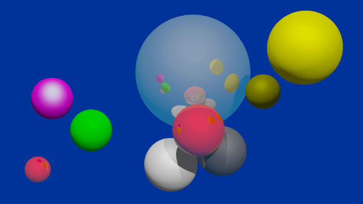

# Raytracer

This **raytracer** is the final mini project of the course *programming languages* in the summer semester of 2019 at the *Bauhaus University Weimar*. The class started with acquiring the basics of C++ before going into the more complex aspects of the language. The final mini project was made by teams of two people.

## What does it do?

This program will parse a `.sdf` file and generate a scene from the `defines` inside. It will then render the shapes, lights, etc. using the defined camera and rendering information as an image in the `.ppm` file format. 

The rendering process is completely done using raytracing and supports simples shapes like spheres, rectangles and triangles. The program also supports blinn-phong shading, reflective and refractive surfaces, transparency, anti-aliasing, tone mapping and gamma correction.

Animation and `.sdf` file generation are also possible. For a demo video of an animated rendered scene, click [here](https://raw.githubusercontent.com/christiandunkel/raytracer/master/documentation/examples/animation_demo.mp4).

## Try it out

If you know what you're doing, you can simply clone or download the repository and build it using [CMake](https://cmake.org/), version `3.1` or higher. Otherwise, you can also follow the step-by-step installation and usage guide here:

## Assignments
- [Style Guide](/documentation/styleguide_2019.pdf)
- [Assignments](/documentation/assignments/)
- [Solutions](/documentation/solutions_theory_part.md)
- [UML Diagram](/documentation/uml_diagram.md)

## Other
- [Documentation](/documentation/documentation.md)
- [Credits](/documentation/credits.md)
- [License](/documentation/license.md)
