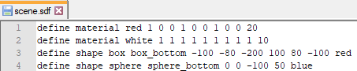
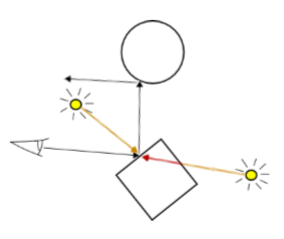

# Documentation
[Back to main page](../README.md)

## Overview

 - [General remarks](#general-remarks)
 - [Raytracing process](#raytracing-process)
 - [How to install](#how-to-install)
	 - [Windows](#windows)
	 - [Linux](#linux)
 - [How to use](#how-to-use)
 - [Creating a scene](#creating-a-scene)
	 - [Camera](#camera)
	 - [Material](#material)
	 - [Background](#background)
	 - [Light](#light)
	 - [Shape](#shape)
	 - [Composite](#composite)
	 - [Transform](#transform)
	 - [Animation](#animation)
	 - [Render](#render)

<br />
<br />
<br />

## General remarks

This raytracer completely works on one thread of the CPU, with no support for GPU and multi-threading. Therefore, the rendering rendering process for images, especially with a lot of objects, higher resolution and graphic settings, can range from a few seconds to a few minutes. *Although this time can be considerably reduced, if you build the project as a release build instead of a debug build.*

<br />
<br />
<br />

## Raytracing process

The program reads an `.sdf` file that contains data about a scene. The scene consists of shapes, lights, transformations, cameras, and rendering information. The program will construct a scene from this information that contains the references to all the shapes, cameras, and lights. Using the rendering information, the raytracer will now generate a **Netpbm** image of the _**P**ortable **P**ix**M**ap_ format.



The raytracer will send out a ray for every pixel from the camera. The ray will hit the closest object or the background, which will be the base color. After that, it will reflect and possibly hit other objects or the background, of which the colors will be used to calculate the final color of the given pixel. 

Additionally, rays from all light sources will be sent out towards the intersection of ray and shape to calculate shadows. In addition to ambient lights, they will influence the final color of the pixel as well.



There are also options to define reflection, transparency and refraction in the materials. The final colors from the ray will also go through a short post-processing using anti-aliasing, tone mapping and gamma correction.

Finally, the program has generated a full array of all pixels for the image. A picture will then be generated as a `.ppm` file. 

The program also supports animations and outputs the defined frames as `.ppm` files if an 'animated scene' is selected in the options. There's also an option to generate animated `.sdf` files instead.

<br />
<br />
<br />

## How to install

This project is written in `C++` and build using the tool [CMake](https://cmake.org/), version `3.1` or higher.

The build was tested in *Linux (Ubuntu)* and *Windows 10*.

In order to run this project, you first want to clone the project by entering the following command in the command prompt in windows or the terminal in Linux.

```
git clone https://github.com/christiandunkel/raytracer
```

You can build the project on both Windows and Linux (tested on Ubuntu). But **make sure** to build it as a *Release build* instead of a *Debug build*, which will result in a considerably faster rendering process.

### Windows

The recommended process for building this project in Windows is to install `Visual Studio 2017` and then `Visual Studio Code`. Install the extensions `CMake 0.0.17` and `CMake Tools 1.1.1` in Visual Studio Code, then open the project folder inside Visual Studio Code. Make a clean build of *source > raytracer* in the new *Cmake* section in the toolbar, and you're done.

After the build is finished, the program will be executed inside the terminal of Visual Studio Code. If you want to find the `.exe` file, it is located in *build > source > raytracer.exe*.

### Linux

In order to build this project in Linux, open the terminal. You have to navigate towards the directory into which you cloned the remote.

```
cd directory/raytracer
```

Enter the following commands in order, which will create the build.

```
mkdir build
cd build
cmake ..
make all
```

After the build is finished, you can directly execute the raytracer by using the following commands in order:

```
cd build/source
./raytracer
```

<br />
<br />
<br />

## How to use

After you have built the project using CMake, you can execute the `raytracer.exe` file using the terminal. Navigate to the top level directory of the project and use the following command:

```
.\build\source\raytracer.exe
```

Doing so will render the scene file that is currently defined in the source code of `raytracer.cpp`. If you want to render a custom scene with *(optionally)* custom settings, you can do so via parameters in your command.

```
.\build\source\raytracer.exe --file "scene.sdf"
```

You can define multiple parameters behind each other. The following parameters currently exist:

- `--file` defines a path to the scene (sdf file)
- `--frames` defines the amount of images to be generated (if there is an animation definition in the scene file)
- `--aa` enables anti-aliasing
- `--recursion` defines the maximum recursion depth per ray *(how often a ray is reflected from surface to surface to determine the pixel color)*
- `--help` show help menu

<br />
<br />
<br />

## Creating a scene

In order to write a custom scene, you need to create a `.sdf` file, which will contain all the definitions for the scene.

- There can only be one definition per line. 
- Non-valid definitions produce warnings. 
- Any file content besides definitions will be ignored.

*Every scene needs at least one material, camera, root composite, a shape, and a render definition.*

### Definitions
- [Camera](#camera)
- [Material](#material)
- [Background](#background)
- [Light](#light)
- [Shape](#shape)
- [Composite](#composite)
- [Transform](#transform)
- [Animation](#animation)
- [Render](#render)

<br />
<br />

---

### Camera

The `camera` property defines the camera looking on to the scene. The camera is defined using a position, a vector that points in the direction the camera looks and a vector that points to up from its origin.

*Multiple cameras can be defined.* The [render](#render) property defines, which camera is used to render the scene as an image.

```
define camera <name> <pos> <front-vector> <up-vector>
```

- `name` is a string, defining the name of the camera.
- `pos` is the position of the camera in world space and consists of 3 numbers for the x-, y- and z-axis that are separated by spaces.
- `front-vector` is the vector pointing in the direction the camera looks from its origin. The parameter consists of 3 numbers for the x-, y- and z-axis that are separated by spaces.
- `up-vector` is the vector pointing up from the origin of the camera. The parameter consists of 3 numbers for the x-, y- and z-axis that are separated by spaces.

*Example definition:*

```
define camera eye 20.0 0 200 200 0 -1 -1 0 1 0
```

<br />
<br />

---

### Material

The `material` property defines the surface properties of all shapes it's assigned to, which includes color, reflection, refraction and opacity.

```
define material <name> <ambient> <diffuse> <specular> <specular-reflection-exponent> <reflection-coefficient> <refraction-index> <opacity> 
```

- `name` is a string, defining the name of the material.
- `ambient` defines the ambient color as a RGB value, consisting of 3 numbers from 0 to 1 that are separated by spaces.
- `diffuse` defines the diffuse color as a RGB value, consisting of 3 numbers from 0 to 1 that are separated by spaces.
- `specular` defines the specular color as a RGB value, consisting of 3 numbers from 0 to 1 that are separated by spaces.
- `specular-reflection-exponent` defines the specular reflection exponent, which should be a number to the power of 2, for example 8, 16 or 32.
- `reflection-coefficient` defines how strongly the rays should experience partial reflectance when passing through a transparent shape. It should be a number between 0 and 1
- `refraction-index` defines how fast the rays pass through a shape, which results in distortion of the background seen through transparent shapes. To turn it off, set it to 0. To turn it on, set the value higher than 1. A number between 1.05 and 1.5 produces the best results.
- `opacity` defines how transparent the object is. It has to be a number from 0 to 1, whereas 0 is non-transparent and 1 is fully-see-through.

*Example definitions:*

```
define material pink 1 0 1 1 0 1 0 1 1 8 0 0 0
define material transparent_green 0 1 0 0 1 0 0 1 0 248 1 1.3 .5
define material reflective_red 1 0 0 1 0 0 1 0 0 16 0.2 0 0
define material mirror_white 0.1 0.1 0.1 0.1 0.1 0.1 0.1 0.1 0.1 8 0.9 0 0
```

<br />
<br />

---

### Background

The `background` property defines the background color of the scene, and will be rendered as part of reflections or in full if a ray hits no object. 

```
define background <color>
```

- `color` defines the background color as a RGB value, consisting of 3 numbers from 0 to 1 that are separated by spaces.

*Example definition:*

```
define background 1 0.2 0
```

<br />
<br />

---

### Light

There are two definitions for light, one for *ambient lights*, which affect the color and lighting of the whole scene, and *diffuse point lights*, which have a position in world space and can throw shadows.

*Ambient Light:*

```
define light <name> <color> <intensity>
```

- `name` is a string, defining the name of the light.
- `color` defines the light color as a RGB value, consisting of 3 numbers from 0 to 1 that are separated by spaces.
- `intensity` is the light intensity. It is a single number that has to be in the range of 0 to 1.

*Diffuse Point Light:*

```
define light <name> <pos> <color> <intensity>
```

- `name` is a string, defining the name of the light.
- `pos` is the position of the diffuse point light in world space, and it consists of 3 numbers for the x-, y- and z-axis that are separated by spaces.
- `color` defines the light color as a RGB value, consisting of 3 numbers from 0 to 1 that are separated by spaces.
- `intensity` is the light intensity. It is a single number that has to be in the range of 0 to 1.

*Example definitions:*

```
define light point_light1 -20 200 -40 1 1 1 0.4
define light ambient_light1 -20 20 -40 1 1 0.2 0.1
```

<br />
<br />

---

### Shape

There are currently multiple simple shapes included in the framework, but only the following shapes are fully supported by the renderer.

*Sphere:*

```
define shape sphere <name> <pos> <radius> <material>
```

- `name` is a string, defining the name of the sphere.
- `pos` is the position of a sphere in world space, and it consists of 3 numbers that are separated by spaces for the x-, y- and z-axis.
- `radius` defines the radius of the sphere. It must be a number bigger than 0.
- `material` is a string that defines the name of the material, which is assigned to the sphere.

*Box (Rectangle):*

```
define shape box <name> <min> <max> <material>
```

- `name` is a string, defining the name of the box.
- `min` is the position of the vertex (corner point) of the box with the smallest values for each the x-, y- and z-axis in world space. It consists of 3 numbers that are separated by spaces for the x-, y- and z-axis.
- `max` is the position of the vertex (corner point) of the box with the biggest values for each the x-, y- and z-axis in world space. It consists of 3 numbers that are separated by spaces for the x-, y- and z-axis.
- `material` is a string that defines the name of the material, which is assigned to the box.

*Triangle:*

```
define shape triangle <name> <vertex> <vertex> <vertex> <material>
```

- `name` is a string, defining the name of the shape.
- `vertex` defines a vertex (corner point) of the triangle. It consists of 3 numbers that are separated by spaces for the x-, y- and z-axis. *Each triangle consists of three such points, resulting in the final definition having 3 points * 3 axes = 9 numbers.*
- `material` is a string that defines the name of the material, which is assigned to the triangle.


*Example definitions:*

```
define shape sphere sphere1 40 60 0 30 green_mat
define shape box box1 -70 -50 -50 70 -30 50 red_mat
define shape triangle triangle1 0 0 0 10 0 0 10 10 0 blue_mat
```

<br />
<br />

---

### Composite

A composite is a group of shapes, which can include other composites. The composite has no geometry of its own, but can be used to transform all its children by simply transforming the composite itself.

A root composite is required in every `.sdf` file. It defines the root node, which includes all shapes in the scene.

```
define shape composite <name> <1st shape> <2nd shape> ... <nth shape>
```

- `name` is a string, defining the name of the composite.
- `shape` is the name of a shape, which may be another composite, which is included as a child in this composite

*Example definitions:*

```
define shape composite triangles triangle1
define shape composite spheres sphere1 sphere2
define shape composite root triangles spheres
```

<br />
<br />

---

### Transform

Transformations manipulate certain properties of shapes. They can be applied to a composite as well. There are three types of transformations supported by the renderer, which are `translate`, `scale` and `rotate`.

`translate` is a transformation property that moves the shape or composite along the three axes in world space by the defined values.

```
define transform <shape> translate <x> <y> <z>
```

- `shape` is a string, defining the name of the shape or composite that will be transformed.
- `x` is value by which to move the shape or composite along the x-axis.
- `y` is value by which to move the shape or composite along the y-axis.
- `z` is value by which to move the shape or composite along the z-axis.

`scale` is a transformation property that defines how much a shape or composite should shrink or grow. For example, setting a parameter to 2 would scale the shape or composite to double its size along that axis, while 0.5 would make it shrink to half its size.

```
define transform <shape> scale <x> <y> <z>
```

- `shape` is a string, defining the name of the shape or composite that will be transformed.
- `x` is value by which to scale the shape or composite along the x-axis.
- `y` is value by which to scale the shape or composite along the y-axis.
- `z` is value by which to scale the shape or composite along the z-axis.

`rotate` is a transformation property that rotates the shape or composite around a given axis by a given angle.

```
define transform <shape> rotate <angle> <axis-vector>
```

- `shape` is a string, defining the name of the shape or composite that will be transformed.
- `angle` is the angle in degrees by which to rotate the shape or composite around the defined axis. For example, to rotate the shape or composite a full round to its original position, the angle would need to be 360.
- `axis-vector` is a vector that defines the axis around which to rotate the shape or composite. It consists of 3 numbers that are separated by spaces for the x-, y- and z-axis. To rotate around the x-axis for example, you would set the parameter to *1 0 0*, and for the y-axis it would be *0 1 0*.


*Example definitions:*

```
define transform spheres translate -20 20 0
define transform spheres scale 4 4 4
define transform spheres rotate 70 0 1 0
```

<br />
<br />

---

### Animation

Animations define a transformation property, which will be applied over multiple frames (images). Only the first frame will be shown in the renderer window, but all generated frames will still be placed as `.ppm` files in the output folder. 

*Multiple animations can be defined.*

The animation **is only enabled**, when the number of frames to be rendered are defined. The frames can be defined when executing the file *raytracer.exe* [using the terminal](#how-to-use).

```
define animation <shape> <transformation> <axes> <speed> <start-frame> <end-frame>
```

- `shape` is a string, defining the name of the shape or composite that will be animated.
- `transformation` is a string that defines the type of transformation, which can be all the available [transformation](#transform) types, for example *translation* or *rotation*.
- `axes` is a string defining the axis or axes around which to apply the transformation. Possible values could be x, xy, z, and so on.
- `speed` is the value by which to transform the shape or composite in every frame of the animation.
- `speed` is the value by which to transform the shape or composite in every frame of the animation. It is a number that should be greater than 0.
- `start` is a number defining the frame at which to start the animation. This number should be equal to or greater than 0.
- `end` is number defining the frame at which to end the animation.

*Example definitions:*

```
define animation root rotate x 1.0 0 20
define animation root scale xyz 0.5 0 20
define animation root translate xy 0.6 0 20
```

<br />
<br />

---

### Render

The `render` property defines the camera, output file and image properties. It is the only property not defined using the `define` prefix. 

**Every scene needs at least one render definition.** However, only the last `render` definition in the `.sdf` file is valid, and previous `render` definitions will be ignored.

```
render <camera> <file-name> <width> <height>
```

- `camera` is a string that defines the camera which is used to render the image.
- `file-name` is a string that defines the file name of the image that will be rendered.
- `width` is a number that defines the width of the rendered image.
- `height` is a number that defines the width of the rendered image.

*Example definition:*

```
render my_camera image.ppm 600 600
```
