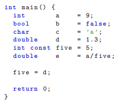

# Theoretical Tasks
[Back to main page](../README.md)

This page contains all answers to the theoretical tasks of assignment 1 to 7. Programming tasks without any theoretical questions are excluded from this page.

## Task 1.4

> In the following example, name types, variables, and values. Explain the keyword `const` in this context. What is type conversion, and why can there be problems? Where do you see problems in the following program code?



In the given code example, a bunch of values are assigned to different types of variables.

```cpp
int a = 9; // whole number type
bool b = false; // truth value type 
char c = 'a'; // character type
double d = 1.3; // floating point number
int const five = 5; // unchangeable whole number type 
double e = a/five; // equals 1.0, since integers are divided first, and only parsed to double afterwards 
five = d; // not possible, since five is a constant
```

## Task 1.5

> Explain the terms initialization and assignment in terms of variables and give an example each. What differences are there?

`Initialization` is the first assignment of a value to a variable, for example: 

```cpp
int a = 10;
```

`Assignment` is the general assignment of a value to a variable, which can but doesn't have to be the initialization. For example, both lines in the following code are assignments of values: 

```cpp
int b = 9; 
b = 10;
```

Every initialization is an assignment, but not every assignment is an initialization. The initialization only happens once, when the variable first gets a value assigned.

## Task 1.6

> Explain the term `declaration`, also sometimes referred to as `forward declaration`, and `definition`, as well as give an example each. What differences are there? Give examples for both in the context of functions, variables, and classes.

`Declaration` means in C++, that you tell the compiler, the type and size of a given variable or constant. This also applies to class structures, where you declare the type (class/struct) and functions, where you declare the function signature with the type and size of all its parameters.

```cpp
extern int a;
void foo();
int bar(int);
class FooBar;
struct BarFoo;
```

`Definition` also reserves space in the memory of the machine in addition to the declaration of type and size.

```cpp
int a;
int b = 10;
int foo(int a) {return a;}
class FooBar{int a;};
struct BarFoo{int a;};
```

A declaration gives the compiler the information, that a variable or function exists, while the definition then reserves memory on the machine.

## Task 1.7

> What is part of the signature of a function? Determine the scope of all variables in the following example.

A `function signature` consists of an access modifier like *public* or *private*, possibly a *static* keyword, a return type, which may also be *void*, if the function will return nothing, and a name. After that, the parameter variables are listed inside parenthesis with their type and local name each.


```cpp
int var = 3; // global scope, valid in whole class

double sum (double a, double b) {
  // a and b are only valid locally inside this function
}

int square(int var) {
  // var is only valid locally inside this function
}

int main() {
  for (int i = 0; i != 100; ++i) {
    // i is only valid inside loop
  }
}
```

## Task 1.16

> Write down a definition for each term in the list.

- `C++` is a generic, imperative, object-oriented, procedural, structured, functional programming language originally designed as an extension of the C language.
- `Source code` is the sequence of high-level language instructions processed by a computer.
- `Compiler` translates program code into machine language for the processor.
- `Linker` is several multiple object files generated by a compiler combined into a single program. 
- `Object code` is a special intermediate product of compilers. It consists of individual modules from the source code that are translated to machine-readable code and can be linked by linkers.
- `Executable file` can be executed as a program by a computer.
- `main()` is the start function of a program written in the C++ language. 
- `#include` includes the content of other files into the source code, which can then be used in the source code.
- `Comments` won't be translated into machine language, and just serve as reminders, descriptions, and explanations for the programmers looking at the source code. 
- `Headers`  are files with the file ending *.h* or *.hpp*, which generally declare functions and variables, that can then be defined in the linked *.cpp* file(s).
- `Programs` are a series of commands to a computer for it to perform certain operations.
- `Output` is the display of the results of an executed program, generally over a terminal.
- `std::cout` is a function of the standard C++ library to output information into the terminal. 
- `std::cin` is a function of the standard C++ library to receive user input from the terminal for usage in the program.
- `<<` is the standard output operator.
- `>>` is the standard input operator.
- `Functions` are programming constructs helpful for structuring the source code, as they can be called using a function invocation. Their content can thus be executed multiple times in different contexts.
- `Functions signatures` declare a function with their access modifier, possibly a static keyword, a return type, a name, and input parameters.
- `Declaration` makes a variable type and name, or function, class, or struct known to the compiler.
- `Definition` reserves space in the memory of the machine for a given declaration.
- `Type` declares the kind of content of a variable or parameter.
- `Typ conversion` describes the process of converting a variable of one type into another type, for example:

```cpp
int i = 1;  
double j = i; // j equals 1.0
```

- `Variables` are a characteristic, number or quantity, that can be increased or decreased, changed or exchanged, and can be referenced by name inside the program.
- `Name` is something by which variables, functions, classes, and similar are referenced inside the source code and by which one can access its content.
- `Value` is the content of a variable, which is associated with a variable name, which can be accessed inside the program using this name.
- `Initialization` is the first assignment of a value to a variable.
- `Assignment` is the general assignment of a value to a variable, which can but doesn't have to be the initialization.
- `const` is a keyword that declares a variable as constant, making it so that its content can only be read, but not changed.
- `Scope` is the region inside the source code, where a variable is valid or *visible*, meaning it can be referenced.

## Task 2.2

> Explain the purpose of the so-called include guards in the partially given header `vec2.hpp`. What happens if you do not use include guards and try to include the `vec2.hpp` file twice? Why is that?


`Include guards` are a technique with which the repeated integration of the same header is prevented. If the header, e.g., * Vec2.hpp*, would be included twice, it would result in compilation errors as the struct Vec2 would be defined twice in this case.

## Task 2.7

> Explain the difference between a `class` and a `struct`. What is a data transfer object (DTO)?

`struct` constructs have public members by default and are useful as data structures.

`class` constructs have private members by default, and these should not be transformed to the public by convention, and should only be retrieved by *get* functions!

`Data transfer objects` or *DTOs* are a design pattern in which multiple data is bundled in one object. You only have public member variables, with as little member functions as possible and with no member functions that can modify the member variables.

## Task 2.9

> What is the difference between a method and a free function in the context of `const` correctness?

According to the C ++ standard, there are no *methods*, although this term is often still used interchangeably with *functions*.  

You could use the term `method` to describe functions that are dependent on an object, meaning they're part of the instance of a class or struct. The term `function` could instead describe global, call-able constructs that aren't part of a class or struct.

Let's take a look at them in terms of `const` correctness. With constant member functions, the promise is given that the object (instance), on which the functions are called, will not be changed. For functions independent of objects, the `const` keyword determines, depending on the application, that a return value or parameter must not be changed.

## Task  2.12

> What does the term `Overloading` mean in C++?

*Overloading* functions describe defining different functions with the same name but different input parameters. When calling the function, the function that matches the given input parameters is used.

## Task 3.1

> Explain the differences between sequential and associative containers. 

`Sequential containers` are container classes that store data in a sequence. The desired value is accessed either via a numerical index, which describes the location of a value in the sequence or by wandering over all other elements until the correct index is reached. Examples in C++ are arrays, vectors, dequeues, and lists.

`Associative containers` are container classes that store data using pairs of key and value, where the key describes the position at which the value is stored in the container. And the value is accessed via the key. Examples in C++ are maps and sets (where the value itself is the key).

> Choose a container for the following use cases and explain your choice
> - saving the points of a polygon
> - assignment of color names and corresponding RGB values
> - FIFO queue of print jobs

- `Saving the points of a polygon`
A *sequential container*, e.g., an *array of 2x1 vectors*, would be the best choice here, since it does not sort by values by default, and you can use the sequential order to find out for each point what the next point to draw is.

- `assignment of color names and corresponding RGB values`
An *associative container* like a *map of 3x1 vectors* would be the best option, because one can use the key for the name of the color and the vector for the RGB values. An additional bonus is that there are no duplicate names allowed in *maps*.

- `FIFO queue of print jobs`
A good choice would be a *sequential container* like a *queue*, because with it you can process each job nicely, one after the other. One does not have to remember the order, because it is already stored in the sequence. And in a queue, one also doesn't have to manage ever-increasing indexes, when new orders are added, and old ones are removed.

### Complexity

| Name | Sequential | Associative |
| :-- | :-- | :-- |
| Insertion | Constant | O(log n) |
| Removal | Constant | O(log n) |
| Search | Constant | O(log n) |

## Task 3.3

> Explain why `std::map` is a good option when trying to determine the frequency of each number in an `std::list`?

`std::map` is useful for this task, because it only has unique keys with one value mapped to it. One can use the increment operators to increase the count for each number, and it will automatically add the number (key) to the container if it isn't yet found within. Additional perks are that *maps* sort keys by default and that searching within them for keys is very efficient being in logarithmic time.

## Task 3.5

> Explain why unexpected behavior can occur with the following program segment:

```cpp
std::map<string, int> matriculation_numbers;
// adding many different students
matriculation_numbers["Max Mustermann"] = 12345;
matriculation_numbers["Erika Mustermann"] = 23523;
// ...
exmatriculation (matriculation_numbers["Fred Fuchs"]);
```

>  How do you avoid this problem? 

`std::map<string, int>` should be `std::map<std::string, int>`, unless the `std` namespace was defined. 
*Maps* do not allow duplicate keys, which may be a problem as student names are used as keys in this example, and duplicate names aren't uncommon. Unique IDs or the matriculation numbers themselves should have been used instead to avoid inconsistencies. 
The function `exmatriculation()` may have no access to the map variable, as it seems to be defined inside the executing function and not globally.

> What options are there for inserting and searching?

Inserting a value into the map can be done by calling it using a key or by calling `std::make_pair()` to generate a pair consisting of key and value and adding it to the map using the `insert()` function.

```cpp
a_map[key] = value;
a_map.insert(std::make_pair(key, value));
```

Deleting a key-value-pair can be done calling the  `erase()` function with a key or iterator. It would delete the element it points to, or a pair of iterators, which would remove all the elements in the range of the two iterators.

```cpp
erase(key)
erase(itr)
erase(itr1,itr2) // range: itr1 to itr2-1
```

Finding a key may be done using the  `count()` function, and testing if the result is at least 1, or by calling `find(key)` and assigning the result to an iterator, then testing if the iterator equals the iterator of the end position in the map.

```cpp
if (test_map.count(key) > 0) {
  // key exists
}
    
itr = test_map.find(key);
if (itr != test_map.end()) {
  // key exists
}
```

`std::search` can be used to find the first occurrence of a character sequence in the given range according to the criterion.

`std::find` can be used to find the first occurrence of an element in the given range according to the criterion.

> Which search functions are `const`?

A normal `iterator` or a constant iterator, or `const_iterator`, may be used to iterate over a container. Normal iterators allow changing the elements that they iterate over, while `const` iterators do not.

## Task 4.8

> Consider and describe how the compiler generates the copy constructor and what happens when it is executed. Note the differences between a shallow and a deep copy.

A `shallow copy` would only copy simple data types and put references for objects or other complex data types. A `deep copy` would, in contrast, copy all content, including other objects referenced inside the object, and create copies of those as well.

A `copy constructor` is called when 
- an object is returned by value
- an object is passed to a function by value
- an object is constructed based on another object of the same class
- the compiler generates a temporary object

By default, the C++ compiler creates its own copy constructor, which produces shallow copies. If there are any pointers, run-time allocation, or a deep copy being required, a custom copy constructor is needed.

The default C++ copy constructor is a function in its basic form and is called when there is an argument pass by value. If one doesn't work with references when constructing one's own copy constructor, it would end up always calling itself and get stuck in an infinite loop.

## Task 5.3

> The initialization of the base class takes place in the initialization list of the constructor of the derived class! Where is the constructor of the base class called?

The constructor of the base class is called if an object (instance) of the base class or a derived class is created. The constructor of the base class would be called first, then followed by the constructor of the derived class.

If an initialization list is used in the constructor of the derived class, the constructor of the base class can be referenced at the beginning of this list, and values can be passed inside, as shown in the following example:

```cpp
Sphere(std::string name) :
Shape(name), middle_(glm::vec3(0.0f)), radius_(0.0f)
{}
```

In the example, the `Sphere` is derived from the base class `Shape`. It is initialized with a `name` variable, that it then passes on to the constructor of its base class in the initialization list.

## Task 5.5

> Explain the effect of the `override` keyword in the context of inheritance! What happens if you omit the keyword?

The keyword `override` ensures that a function in the base class is virtual, and if that is not the case, throws a compile error. It pretty much declares that a function overrides its virtual equivalent in the base class.

As this keyword is only an indicator for the compiler and not a requirement when trying to override a virtual function, nothing will happen if it is omitted.

## Task 5.7

> Using the example, explain the terms `static type of a variable` and `dynamic type of a variable`.

A `dynamic variable` is a variable whose address is determined when the program is run. In contrast, a `static variable` is already known at compilation time, and has, therefore, memory reserved for itself at compilation time by the machine.

> What are the dynamic and static types of variables s1 and s2?


In the example, for both variables, `shared pointers` are used, which are `smart pointers` that retain the shared ownership of an object. Several smart pointers may own the same object. The object is only destroyed when either the last smart pointer owning it is destroyed or the last smart pointer owning it is assigned another pointer via the function `reset()`. The shared pointer can own an object while storing a pointer to another. For example, it can be used to point to an object's member while still owning the object itself.

Using `std::make_shared` an object of a given type is constructed and wrapped inside a smart pointer.

```cpp
std::shared_ptr<Sphere> s1 = std::make_shared<Sphere>(position, 1.2f, red, "sphere0");
```

The first line creates a static pointer to a static object, which is known at compilation time. This pointer can access all functions of the `Sphere` class.

```cpp
std::shared_ptr<Shape> s2 = std::make_shared<Sphere>(position, 1.2f, red, "sphere1");
```

This is the second line, and it creates a static pointer to a dynamic object. It looks in run time for the `Sphere` class, and can only run functions of the `Sphere` class itself, and none of the stand-alone functions of the base class `Shape`. Although, all virtual functions of the base class that were overridden will continue to work.

## Task 5.8

> In what order are the constructors and destructors in the following example called?


At first, the constructor for the base class `Shape` will be called with the constructor of the derived class `Sphere` afterward, each time an object (instance) is created. For the destructor, it is the other way around, and the constructor of the derived class `Sphere` will be called first, followed by the constructor for the base class `Shape`.

### Order of constructor and destructor calls

1. constructor s1 (shape)
2. constructor s1 (sphere)
3. constructor s2 (shape)
4. constructor s2 (sphere)
5. destructor s1 (sphere)
6. destructor s1 (shape)
7. destructor s2 (sphere)
8. destructor s2 (shape)

>  Remove the keyword `virtual` from the destructor of the base class, test again and explain the difference.

On removing the keyword `virtual` from the destructor of the base class `Shape`, including all `override` tags in the derived class, the destructor for the second sphere is only called once since it's not linked with child class. That is because the object's type is `Shape`, but it points to a `Sphere` instance. If `delete` is called on the object, the compiler looks up `size_of` for the size of the object, but only receives the size of the base class `Shape`, because of the missing keyword. Therefore, it will call only one destructor, which is the only one it knows, being the destructor of the base class `Shape`.

### Order of constructor and destructor calls

1. constructor s1 (shape)
2. constructor s1 (sphere)
3. constructor s2 (shape)
4. constructor s2 (sphere)
5. destructor s1 (sphere)
6. destructor s1 (shape)
7. destructor s2 (shape)

## Task 5.9

> Explain the differences between `class hierarchy` and `object hierarchy`, as well as `class diagram` and `object diagram`.

The `class hierarchy` is a tree-like structure that displays the relations between the given classes in the program. For example, which class acts as the base class of which classes, and what classes are derived from it.

The `object hierarchy` describes the relations between specific objects in a system, for example, their order and composition, and if they're parents, children, and siblings.

The `class diagram` displays the class hierarchy of a system using a diagram, which may include the class names, attributes, functions, accessibility, and their relations.

The `object diagram` displays the object hierarchy of a system using a diagram. It shows the specific objects with their names, belonging class, attributes and values, and relations to other specific objects. Multiple objects of the same instance can be displayed.

## Task 6.1

> Explain the ray-tracing algorithm presented in the exercise.  Draw an example of beam paths in the given sketch.


```cpp
void raycast()
    for all pixels(x,y)
        image(x,y) = trace( compute_eye_ray(x,y) )
```

The function goes through each pixel of the image and sends out a ray. It gets a color for the given pixel and returns a pixel array, which will then later be converted to an image and displayed.

```cpp
rgbColor trace(ray r)
    for all objects o
        t = compute_intersection(r, o)
        if (t < closest_t)
            closest_t = t
            closest_o= o
        if (closest_o != 0)
            return shade(closest_o, r, closest_t)
        else
            return background_color
```

This function will compute the intersection of the rays with all objects. If no object is found within the path of the ray, it will return the background color. Otherwise, it will look at the first object the ray hits on its path. It will compute the shade at the intersection and return the calculated final color.

```cpp
rgbColor shade(object o, ray r, double t)
    point x = r(t)
    // evaluate (Phong) illumination equation
    return color
```

With this function, the raytracer will send another ray from the intersection point to all "point lights" and check if there are objects in the path. It may also be the other way around, with all point lights sending a ray to the intersection point instead (if programmed that way). It will compute lighting using the Phong model using the point lights and the ambient light. After that, the shading-corrected color for the pixel will be returned.

Missing in the algorithm is the aspect of reflection. To realize a simple reflection, one would need to shoot out rays from each intersection point using the light reflection angle. If the second ray hits another object, the object's color would be returned, and a new ray would be sent out (up until a specific hard-coded limit). If a non-primary ray reaches the max depth without hitting an object, it will return the background color. With each new ray, the returned colors would have less influence on the original pixel color. One would also have to look at the distance that each of the non-primary rays traveled to adjust their impact on the original pixel color.